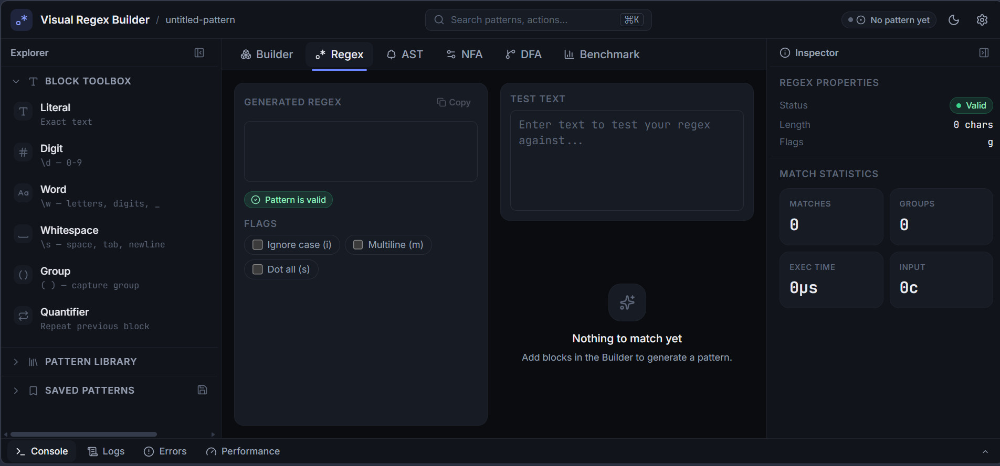
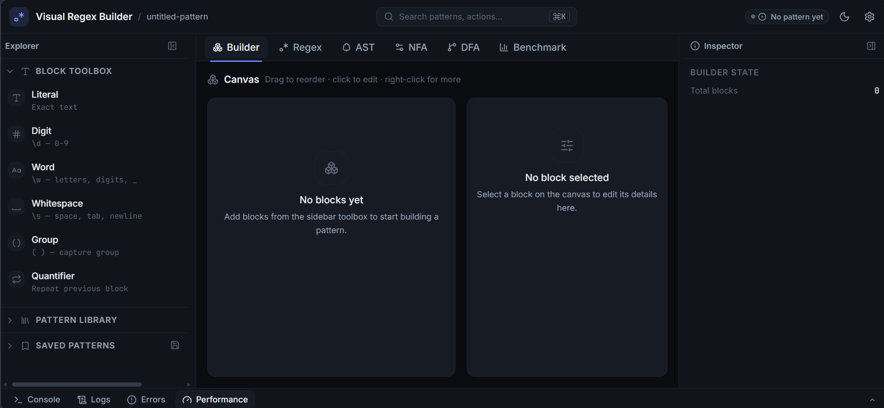
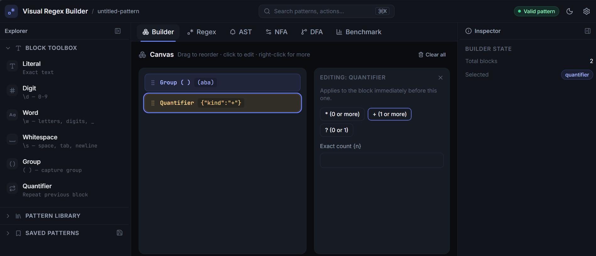
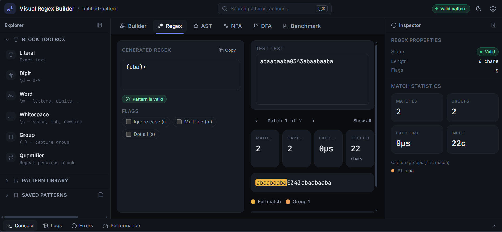
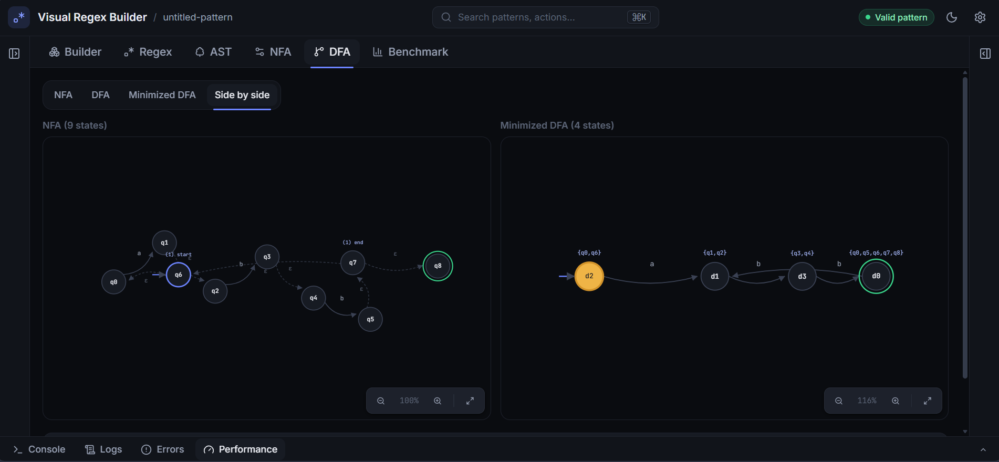
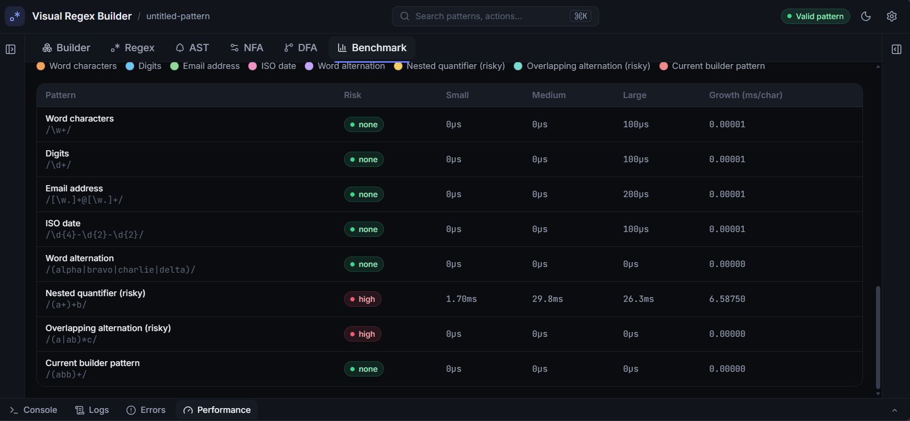

# Visual Regex Builder & Debugger

A drag-and-drop visual regex builder paired with a real-time debugger and a
full educational compiler pipeline for regular expressions, presented in a
dark-first, IDE-style interface. Build a pattern visually from blocks, watch
it match live against your own test text, and inspect exactly how that
pattern becomes a tokenizer → parser → AST → Thompson's-construction NFA →
subset-construction DFA → Hopcroft-minimized DFA, all rendered as interactive,
pannable/zoomable D3 diagrams — with a benchmarking suite that measures real
performance and flags catastrophic backtracking risk before it can freeze
your browser.

This project doubles as a working reference implementation of the classic
automata-theory algorithms (Thompson's construction, subset construction,
Hopcroft's minimization) applied to an actual, usable tool rather than a
textbook exercise.

## 🚀 Demo

> **Live Demo:** https://visual-regex-builder.vercel.app/

---

<p align="center">
  
</p>

---

> **Looking for the full story?** This README covers the project as it
> stands today. For the complete development history — every milestone
> from the first drag-and-drop prototype through the compiler pipeline,
> the DFA/benchmarking layer, and the full IDE redesign, including every
> design decision and bug fixed along the way — see
> **[PROJECT_GUIDE.md](./PROJECT_GUIDE.md)**.

---

## Why This Project?

Regular expression tools typically solve only one part of the problem.

Some provide a text editor for writing patterns. Others visualize automata. Some benchmark regex performance. Educational tools often demonstrate compiler theory but are disconnected from practical development workflows.

This project combines those ideas into a single interactive application.

A pattern can be built visually, debugged against live input, compiled into an Abstract Syntax Tree, transformed into a Thompson NFA, converted into a DFA through subset construction, minimized with Hopcroft's algorithm, and benchmarked for performance without leaving the same interface.

The goal was not simply to build another regex tester, but to bridge **compiler construction**, **formal language theory**, and **modern frontend engineering** in a way that makes complex algorithms understandable, interactive, and immediately useful.

---

## Table of contents

- [Features](#features)
- [Interface](#interface)
- [Tech stack](#tech-stack)
- [Getting started](#getting-started)
- [Available scripts](#available-scripts)
- [Project architecture](#project-architecture)
- [The compiler pipeline, stage by stage](#the-compiler-pipeline-stage-by-stage)
- [Project structure](#project-structure)
- [Design notes and known limitations](#design-notes-and-known-limitations)
- [Contributing](#contributing)
- [License](#license)
- [Full project guide](./PROJECT_GUIDE.md)

---

## Feature Overview

| Category | Highlights |
|----------|------------|
| 🎨 Visual Builder | Drag-and-drop regex construction with editable blocks and live pattern generation |
| ⚡ Live Debugger | Real-time matching, capture groups, syntax validation, execution timing |
| 🌳 Compiler Pipeline | Tokenizer, recursive descent parser, typed AST, Thompson's NFA |
| 🔄 Automata | Subset construction, DFA minimization (Hopcroft), interactive simulation |
| 📈 Benchmarking | Dataset generation, performance comparison, catastrophic backtracking detection |
| 🖥 Modern UI | IDE-style interface, command palette, resizable panels, dark/light themes |

---

## Screenshots

The application is organized into a modern IDE-style interface where every stage of the regex compilation pipeline is interactive.

### Main Workspace

> Full application layout showing the Builder, Debugger, AST, Automata visualizations, and Benchmarking dashboard.



---

### Visual Regex Builder

Build regular expressions using drag-and-drop blocks with live pattern generation.



---

### Live Regex Debugger

Inspect matches, capture groups, execution timing, and validation as you type.



---

### Compiler Pipeline

Explore the generated Abstract Syntax Tree together with Thompson's NFA, DFA, and minimized DFA.



---

### Performance Benchmarking

Compare regex variants, inspect execution time, and detect catastrophic backtracking risks.



---

## Features

### Visual pattern builder
- Drag-and-drop block-based regex construction (literals, digit/word/whitespace
  classes, groups, quantifiers) — no need to hand-write regex syntax.
- Inline editing of any block: literal text, group contents/name/capturing
  flag, and quantifier presets (`*`, `+`, `?`, `{n}`, `{n,m}`).
- Reorder blocks by dragging; the generated pattern updates live.

### Real-time debugger
- Live regex execution against your own test text using the native `RegExp`
  engine — updates automatically as you edit blocks, toggle flags, or type.
- Match highlighting that preserves all original text formatting and
  whitespace.
- Color-coded capture groups (including named groups) shown per match.
- Match statistics: total matches, capture group count, execution time
  (measured with `performance.now()`), input length.
- Pattern validity is checked continuously; invalid patterns are reported
  clearly and never crash the app.
- Toggleable flags (`i`, `m`, `s`).

### Compiler pipeline & automata visualization
- A real tokenizer that lexes regex syntax (literals, escapes, character
  classes, groups, quantifiers, alternation).
- A recursive descent parser producing a typed AST, with a collapsible tree
  viewer for inspecting the parsed structure.
- **Thompson's construction**: converts the AST into an NFA, fragment by
  fragment, exactly per the textbook algorithm.
- An NFA simulator with step-by-step playback (play/pause/step/reset) that
  tracks every live state simultaneously (true subset/powerset simulation,
  not a single-path guess).
- **Subset construction**: converts the NFA into an equivalent DFA using
  exported, reusable `epsilonClosure()` and `move()` functions. Correctly
  handles overlapping guards (e.g. a literal `5` alongside `\d`) via
  signature-based alphabet partitioning, so the resulting DFA is genuinely
  deterministic.
- **Hopcroft's algorithm**: minimizes the DFA via partition refinement,
  producing the smallest equivalent automaton.
- A DFA simulator with the same playback controls as the NFA one.
- An interactive D3 force-directed graph for both NFA and DFA: pan, zoom,
  drag nodes, automatic layout, a start-state arrow, double-circle accepting
  states, labeled transitions (including dashed ε-transitions), and live
  highlighting of whichever states/transitions are active during simulation
  playback.
- Switch between NFA, DFA, and minimized-DFA views, or view any two side by
  side.
- A comparison panel: state counts, transition counts, accepting-state
  counts, construction timing per stage, and the minimization reduction
  percentage.

### Performance benchmarking
- Benchmarks a fixed suite of common patterns (word, digit, email, date,
  alternation) plus deliberately risky patterns against generated datasets
  of increasing size, timing every run with `performance.now()`.
- Results rendered as both a sortable table and an SVG line chart of
  execution time vs. dataset size.
- **Catastrophic backtracking detection**, combining two signals:
  - *Static*: walks the AST looking for the canonical ReDoS shapes — nested
    quantifiers and alternation branches with overlapping prefixes inside a
    repeated group.
  - *Dynamic*: confirms or escalates the static warning using actual
    measured growth across dataset sizes, or an outright timeout.
- Patterns flagged as high-risk are **never run against full-size data**.
  Since JavaScript's `RegExp.exec` cannot be preempted mid-execution on the
  same thread, the benchmarker instead runs an adaptive, single-character-
  stepping safety probe first to discover the largest input length that's
  actually safe to test, bounding worst-case cost instead of trusting a
  fixed guess. This was empirically stress-tested against patterns nested
  up to 8 levels deep without ever hanging.

## Interface

The app is laid out as a dark-first, IDE-style shell, inspired by VS Code,
Linear, Raycast, and Postman:

- **Top bar** — logo/project name, a live pattern-validity badge, a
  command-palette trigger (`⌘K` / `Ctrl+K`), theme toggle, and settings.
- **Left sidebar** *(resizable, collapsible)* — the block toolbox, a
  pattern library of common presets, and saved patterns (persisted across
  reloads, with save/load/delete via context menu).
- **Center workspace** — six tabs (**Builder · Regex · AST · NFA · DFA ·
  Benchmark**), each occupying the full workspace rather than stacking
  every panel at once.
- **Right inspector** *(resizable, collapsible)* — context-aware: shows
  regex properties and match statistics on the Regex tab, NFA/DFA/minimized
  state counts and construction timing on the NFA/DFA tabs, and builder
  state on the Builder tab.
- **Bottom dock** *(resizable, collapsible)* — Console, Logs, Errors, and
  Performance tabs reflecting real pipeline activity (compiles, validation
  errors, per-stage construction timing as a bar chart), not placeholder
  content.
- **Command palette** (`⌘K`) — fuzzy-searchable navigation and actions
  (jump to any tab, toggle theme/panels, clear the canvas).

Layout state (panel widths, collapsed state, dock height, active tab,
theme) persists to `localStorage` across reloads.

All interactive primitives — buttons, inputs, tabs, tooltips, dropdown and
context menus, modals, badges, toasts, skeletons, empty states — are
shared components in `src/design-system/`, built on a single token system
(`src/index.css`) of semantic colors, spacing, radii, shadows, and motion
durations, so every surface in the app follows one consistent visual
language rather than each panel inventing its own.

---

## Highlights

- Built entirely in **TypeScript** using modern React architecture.
- Compiler pipeline implemented **from scratch** without parser or automata libraries.
- Interactive D3 visualizations for NFAs, DFAs, and minimized DFAs.
- Live regex debugging synchronized with every stage of compilation.
- Production-style IDE interface with persistent layouts, command palette, and context-aware panels.
- Performance benchmarking with catastrophic backtracking analysis.
- Designed as both a practical developer tool and an educational reference implementation for automata theory.

---

## Tech stack

| Layer | Choice |
|---|---|
| Framework | React 19 + TypeScript |
| Build tool | Vite 8 |
| Styling | Tailwind CSS v4, custom design tokens via `@theme` |
| Fonts | Inter (UI), JetBrains Mono (regex/code/console), self-hosted via `@fontsource` |
| Icons | `lucide-react` |
| State management | Zustand (with `persist` middleware for layout/saved patterns) |
| Drag and drop | `@dnd-kit` |
| Graph visualization | D3.js (force simulation, zoom, drag) |
| Linting | oxlint |

No regex parsing library, no automata library — the tokenizer, parser,
Thompson's construction, subset construction, Hopcroft minimization, and
benchmarking engine are all implemented from scratch in `src/engine/`.

## Getting started

### Prerequisites
- [Node.js](https://nodejs.org/) 20 or later (Vite 8 and the dependencies
  here require a current Node version)
- npm (ships with Node)

### Installation

```bash
git clone https://github.com/shehzadres/visual-regex-builder.git
cd visual-regex-builder
npm install
```

### Run it

```bash
npm run dev
```

## Available scripts

| Command | Description |
|---|---|
| `npm run dev` | Start the Vite dev server with hot module reload |
| `npm run build` | Type-check the whole project (`tsc -b`) and produce a production build in `dist/` |
| `npm run preview` | Serve the production build locally to sanity-check it |
| `npm run lint` | Run `oxlint` over `src/` |

---

## Validation & Testing

The implementation has been verified through a combination of automated checks and manual validation.

- 700+ cross-validation cases against JavaScript's native `RegExp`
- Parser validation across supported regex constructs
- NFA and DFA behavioral consistency checks
- DFA minimization verification
- Stress testing for catastrophic backtracking scenarios
- Production build verification using TypeScript and Vite

---

## Project architecture

The app is organized around one principle: **everything downstream of the
builder recomputes automatically**. There is no "run" or "compile" button
anywhere in the main pipeline — editing a block, typing test text, or
toggling a flag immediately re-derives every dependent stage via React hooks
backed by `useMemo`.

```
Builder blocks (Zustand store)
        │
        ▼
generateRegex()  ──────────────►  pattern string
        │                                │
        ▼                                ▼
 useRegexMatcher()              useRegexAutomaton()
        │                                │
        ▼                                ▼
 runRegexMatch()                 tokenize() → parseRegex()
   (native RegExp,                       │
    timed, capture                       ▼
    groups extracted)              buildNFA()  (Thompson's construction)
        │                                │
        ▼                       ┌────────┴────────┐
  Match highlighting,            ▼                 ▼
  capture group colors,    nfaToGraph()      buildDFA()  (subset construction)
  match stats                   │                 │
                                 ▼          ┌───────┴───────┐
                          D3 NFA graph      ▼               ▼
                                      dfaToGraph()   minimizeDFA()  (Hopcroft)
                                            │               │
                                            ▼               ▼
                                     D3 DFA graph    dfaToGraph()
                                                            │
                                                            ▼
                                                   D3 minimized DFA graph
```

Two custom hooks are the synchronization points for the whole app:

- **`useRegexMatcher`** (`src/hooks/useRegexMatcher.ts`) — drives the Week
  1/2 builder-to-debugger pipeline.
- **`useRegexAutomaton`** (`src/hooks/useRegexAutomaton.ts`) — drives the
  full compiler pipeline (tokenize → parse → NFA → DFA → minimized DFA),
  timing each construction stage with `performance.now()` for the
  comparison panel.

Both hooks call the exact same `generateRegex()` function, so the pattern
shown in the **Generated Regex** panel, the one actually matched in the
**Debugger**, and the one compiled in the **Automaton** panels are always
provably identical — never three slightly-different copies.

## The compiler pipeline, stage by stage

1. **Tokenizer** (`engine/lexer/tokenizer.ts`) — converts a pattern string
   into a flat token stream: literals, escaped classes (`\d \w \s` and
   their negations), escaped literals, bracket character classes, groups
   (capturing, non-capturing `(?:...)`, named `(?<name>...)`), quantifiers
   (`* + ? {n} {n,} {n,m}`), and alternation (`|`). Malformed input raises a
   typed `TokenizerError` rather than throwing blindly.

2. **Parser** (`engine/ast/parser.ts`) — a recursive descent parser
   implementing the grammar:
   ```
   Alternation → Concat ('|' Concat)*
   Concat      → Quantified*
   Quantified  → Atom Quantifier?
   Atom        → CHAR | ESCAPED_CHAR | ESCAPED_CLASS | '.' | CharClass | Group
   ```
   producing a typed AST (`Literal`, `Concat`, `Alternation`, `Group`,
   `Quantifier`, `CharClass`, `EscapedClass`, `AnyChar`, `Empty`).

3. **Thompson's construction** (`engine/automata/thompsonConstruction.ts`)
   — the classic algorithm for converting a regex AST into an NFA:
   every AST node becomes a small NFA *fragment* with one dangling start
   and one dangling accept state, and fragments are wired together with
   ε-transitions according to the node type (concatenation chains
   fragments; alternation branches and rejoins; `*`/`+`/`?`/`{n,m}` add the
   appropriate loop-back or skip ε-transitions).

4. **Subset construction** (`engine/automata/subsetConstruction.ts`,
   `engine/automata/epsilonClosure.ts`) — the standard NFA-to-DFA
   algorithm: starting from `ECLOSE(start)`, repeatedly computes `move()`
   and `ECLOSE()` over a disjoint partition of the input alphabet to
   discover new DFA states until no new subsets appear. The alphabet
   partitioning step is the part that needs care beyond the textbook
   version — see [Design notes](#design-notes-and-known-limitations) below.

5. **Hopcroft's algorithm** (`engine/automata/dfaMinimization.ts`) —
   minimizes the DFA via partition refinement: starts with two blocks
   (accepting / non-accepting) and repeatedly splits any block whose
   states disagree on which block they transition into for some symbol,
   using a worklist of (block, symbol) pairs, until the partition is
   stable. Two states end up in the same final block exactly when they're
   Myhill–Nerode equivalent.

6. **Graph conversion** (`engine/automata/nfaGraph.ts`,
   `engine/automata/dfaGraph.ts`) — both NFA and DFA share the same
   `AutomatonGraph` shape (plain nodes/edges with a BFS-layer hint for
   initial layout), so the same D3 rendering component draws either.

7. **Benchmarking** (`engine/benchmark/`) — generates synthetic datasets,
   runs each configured pattern against them with `performance.now()`
   timing, and cross-checks structural (AST-based) and runtime (growth-
   rate-based) signals for catastrophic backtracking risk.

## Project structure

```
src/
├── components/
│   ├── shell/             TopBar, Sidebar, Workspace, Inspector, BottomDock,
│   │                      CommandPalette, patternLibraryData
│   ├── design-system/     Button, Input, Badge, Tooltip, Tabs, Card,
│   │                      EmptyState, Skeleton, Toast, DropdownMenu,
│   │                      ContextMenu, Modal, ResizeHandle, ThemeSync
│   ├── builder/           BuilderTab, Canvas, RegexBlock, BlockEditor,
│   │                      RegexOutput, RegexTab
│   ├── visualizer/        TextInput, MatchVisualizer, HighlightedText,
│   │                      CaptureGroups, MatchControls, MatchLegend
│   ├── automata/          ASTTab, ASTViewer, NFATab, NFAGraphView,
│   │                      SimulatorControls, DFATab, DFASimulatorControls,
│   │                      AutomatonGraphSwitcher, ComparisonPanel
│   └── benchmark/         BenchmarkTab, BenchmarkPanel, BenchmarkTable,
│                          BenchmarkChart, BacktrackWarning
│
├── engine/
│   ├── parser/            regexGenerator.ts (blocks → pattern string), escape.ts
│   ├── matcher/           regexMatcher.ts, captureGroups.ts, matchTypes.ts
│   ├── lexer/             tokenizer.ts, tokenTypes.ts
│   ├── ast/               parser.ts (recursive descent), astTypes.ts
│   ├── automata/          thompsonConstruction.ts, subsetConstruction.ts,
│   │                      dfaMinimization.ts, epsilonClosure.ts,
│   │                      nfaSimulator.ts, dfaSimulator.ts,
│   │                      nfaGraph.ts, dfaGraph.ts, nfaTypes.ts, dfaTypes.ts,
│   │                      automatonStats.ts
│   └── benchmark/         benchmarkRunner.ts, datasetGenerator.ts,
│                          catastrophicBacktrackDetector.ts, benchmarkTypes.ts
│
├── hooks/                 useRegexMatcher.ts, useRegexAutomaton.ts,
│                          useConsoleLogging.ts
├── store/                 regexStore.ts, uiStore.ts (layout, persisted),
│                          savedPatternsStore.ts (persisted),
│                          consoleLogStore.ts
├── types/                 regex.ts, match.ts, automata.ts
├── utils/                 colors.ts, textHelpers.ts
├── index.css              Design tokens (@theme): colors, fonts, radii,
│                          shadows, motion durations; dark + light themes
├── App.tsx
└── main.tsx
```

## Algorithms Implemented

- ✅ Recursive Descent Parsing
- ✅ Thompson's Construction
- ✅ Epsilon Closure
- ✅ Subset Construction
- ✅ Hopcroft DFA Minimization
- ✅ NFA Simulation
- ✅ DFA Simulation
- ✅ Catastrophic Backtracking Analysis

## Design notes and known limitations

**The interface is a presentation-layer rewrite over an unchanged engine.**
The IDE shell, design system, and every component's markup were redesigned
from a four-panel layout into a tabbed workspace with sidebar/inspector/dock,
but the underlying regex engine, hooks, and Zustand stores that do the actual
compiler work were not altered — `useRegexMatcher` and `useRegexAutomaton`
remain the single synchronization points feeding every tab.


**Alphabet partitioning in subset construction.** NFA transitions in this
project carry predicates (`\d`, `\w`, character classes, `.`) rather than
single discrete characters, so the textbook "for each symbol in the
alphabet" step of subset construction can't just iterate over every
possible character. The implementation instead derives a *disjoint*
partition of the alphabet directly from the guards actually used in the
pattern (every literal character probed against every guard, grouped by
which guards match), which correctly handles overlapping guards — e.g. a
pattern like `(5|\d)` where the literal `5` and the class `\d` both match the
same character. This was specifically tested against 700+ cross-checks
against JavaScript's native `RegExp` to confirm correctness, including the
overlap case.

**Benchmark safety against catastrophic backtracking.** JavaScript's
`RegExp.exec` runs synchronously and cannot be preempted mid-call from the
same thread — there's no real timeout available without a Web Worker. The
benchmarking module therefore never blindly hands a structurally-risky
pattern a large input. It first runs an adaptive probe that steps the input
length up one character at a time with a tight per-step time budget,
stopping the moment a step exceeds budget, and only ever benchmarks lengths
already proven safe. This was deliberately stress-tested against nested
quantifiers up to 8 levels deep (`((((((((a+)+)+)+)+)+)+)+b`) without
hanging.

**Subset construction state explosion.** Like any real implementation of
subset construction, sufficiently complex patterns can produce a DFA with
many more states than the source NFA (in the worst case, exponentially
more). The comparison panel surfaces this directly via the NFA→DFA
expansion ratio so it's visible rather than hidden.

**This is a from-scratch educational implementation**, not a
production-grade regex engine. It supports the common subset of regex
syntax (literals, escapes, classes, groups including named/non-capturing,
quantifiers including counted ranges, alternation) but not lookaheads,
lookbehinds, backreferences, or Unicode property escapes.

## Roadmap

Future enhancements include:

- WebAssembly-powered regex engine written in Rust
- Cross-language regex generation (JavaScript, Python, Go, Java)
- Additional regex syntax support (lookarounds, backreferences, Unicode properties)
- Regex explanation mode
- Export automata as SVG and Graphviz
- Import existing regex patterns into the visual builder
- Interactive algorithm tutorials

## Contributing

Issues and pull requests are welcome — see [CONTRIBUTING.md](./CONTRIBUTING.md)
for setup instructions, the engine-change checklist, and how to verify
correctness before opening a PR. The short version: if you're adding a new
regex feature, it needs to flow through the whole pipeline consistently
(`tokenizer → parser/AST → Thompson's construction → subset construction →
minimization → graph rendering`) — adding support at only one stage will
make the tabs disagree with each other.

For the complete development history of this project — every milestone,
every design decision, every bug that was caught and fixed, and exactly
why the codebase is structured the way it is — see
[PROJECT_GUIDE.md](./PROJECT_GUIDE.md).

## License

[MIT](./LICENSE)
